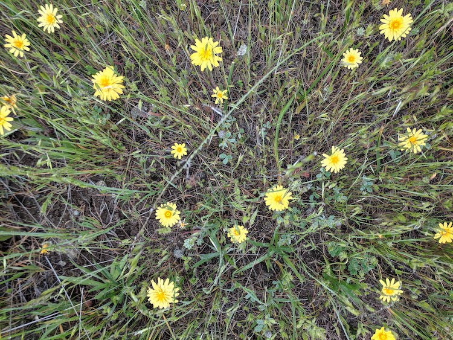

<!-- README.md is generated from README.Rmd. Please edit that file -->

# sedgwickcover

<!-- badges: start -->

<!-- badges: end -->



***Agoseris heterophylla* and *Trifolium albopurpureum* among annual
grasses in rocky serpentine grassland near site 745**

## Overview:

This is an R data package with vascular plant cover and density at 24
study sites located across the [University of California Sedgwick
Reserve](https://sedgwick.nrs.ucsb.edu/) in Santa Barbara County,
California. These sites are the focus of demographic and community
functional trait studies in the [Kraft Lab at
UCLA](https://sites.lifesci.ucla.edu/eeb-kraft/).

 **Sedgwick
Map:** A) Map of all 24 sites across the reserve–only the lower sites
are labeled. Sites labeled 740 to 763. B) Inset showing locations of
upper sites.  
<!--sites mapped with the data-raw/map_sedgwick_ggmap.R script -->

## Installation

You can install sedgwickcover from [GitHub](https://github.com/) with:

``` r
# install.packages("devtools")
devtools::install_github("akleinhesselink/sedgwickcover")
```

## Usage

`library(sedgwickenv)` will load the following datasets:

  - **site\_cover\_2019**: dataframe with average cover and total
    abundance of vascular plants at each of the 24 sites in the spring
    of 2019
  - **plot\_cover\_2019**: dataframe with cover and density of vascular
    plants in 5 sampling plots at each of the 24 sites in the spring of
    2019
  - **site\_cover\_2017**: dataframe with average cover of vascular
    plants at each of the 24 sites in the spring of 2017
  - **plot\_cover\_2017**: dataframe with cover of vascular plants in 5
    sampling plots at each of the 24 sites in the spring of 2017
  - **microplot\_cover\_2017**: dataframe with cover of vascular plants
    in 2 microplots nested within each fo the 5 sampling plots at each
    of the 24 sites in the spring of 2017
